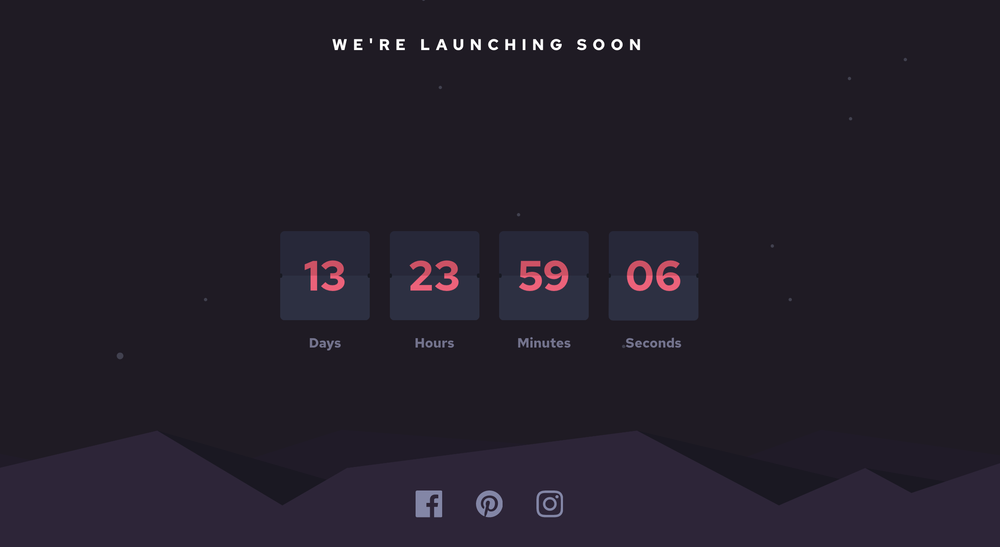

# Frontend Mentor - Launch countdown timer solution

This is a solution to the [Launch countdown timer challenge on Frontend Mentor](https://www.frontendmentor.io/challenges/launch-countdown-timer-N0XkGfyz-). Frontend Mentor challenges help you improve your coding skills by building realistic projects.

## Table of contents

- [Overview](#overview)
  - [The challenge](#the-challenge)
  - [Screenshot](#screenshot)
  - [Links](#links)
- [My process](#my-process)
  - [Built with](#built-with)
  - [What I learned](#what-i-learned)
  - [Continued development](#continued-development)
  - [Useful resources](#useful-resources)
- [Author](#author)
- [Acknowledgments](#acknowledgments)

## Overview

### The challenge

Users should be able to:

- See hover states for all interactive elements on the page
- See a live countdown timer that ticks down every second (start the count at 14 days)
- **Bonus**: When a number changes, make the card flip from the middle

### Screenshot



### Links

[My Solution](https://flipcard-countdown.vercel.app/)

### Built with

- [React](https://reactjs.org/) - JS library
- [Styled Components](https://styled-components.com/) - For styles
- [React-spring](https://react-spring.io/) - Animation library

### What I learned

This is my first time working with react-spring library.

Working out how the animation works needed some time, but i got my head around it.

Therefore this is the code snippet i am most proud of. It doesnt look like much, but it is the result of a deepdive into the react-spring documentation.

It defines the animation and, crucially, lets me pass in the condition wether the animation runs as a boolean.

```js
const frontCardAnimation = useSpring({
  from: { transform: 'rotateX(0deg)' },
  to: { transform: 'rotateX(-180deg)' },
  delay: 0,
  config: config.slow,
  reset: cancelAnimation,
})
const backCardAnimation = useSpring({
  from: { transform: 'rotateX(180deg)' },
  to: { transform: 'rotateX(0deg)' },
  delay: 0,
  config: config.slow,
  reset: cancelAnimation,
})
```

### Continued development

The Clock runs smooth in a browser like google-chrome. However in Firefox there seems to be a glitch, that the updated number shines through befor the animation triggers.

I suspect the solution to this Problem requires some learning, how firefox and chrome handle animations with react-spring.
